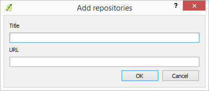
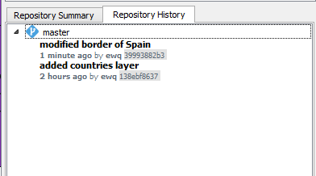
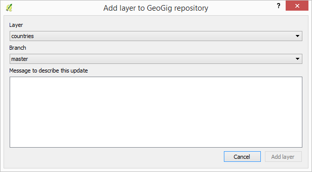
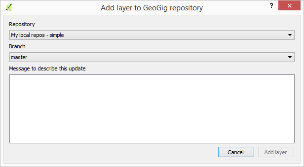
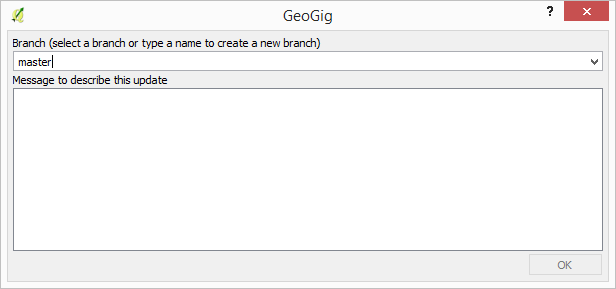
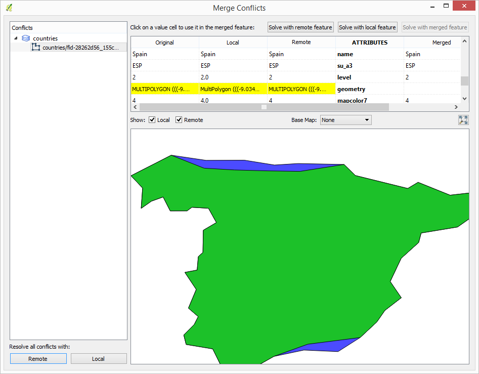
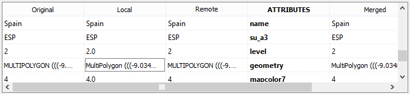

The GeoGig QGIS plugin allow you to manage GeoGig repositories from QGIS, adding layers to your QGIS projects from a GeoGig repository and updating it with the changes that you make to those layers using QGIS editing capabilities.

This document describes a typical workflow with the GeoGig plugin, going through its main features.

Starting the GeoGig server
***************************

The GeoGig plugin connects to GeoGig using its WebAPI. If you want to work with local repositories, you must start the GeoGig by running

::

	geogig serve -m

from the folder that contains you repository folders.

Creating repos is not currently supported through the WebAPI, so you must create your repositories in advance using 

::

	geogig init

Connecting to a repository
**************************************

The first step to work with the GeoGig plugin is to connect to a GeoGig WebAPI endpoint, which serves one or multiple repositories.

Open the GeoGig navigator by selecting the *GeoGig/GeoGig Navigator* menu.

.. image:: addlayermenu.png
	:align: center

Click on the *Add repositories* button and you will see the following dialog:

Enter the URL to the WebAPI endpoint and a name to identify the service. Click on OK

A new entry in the navigator will be added, which will contain all repositories served by the selected endpoint.

.. image:: reposinnavigator.png
	:align: center

Clicking on a repository will update the elements in the lower part of the navigator. There you can find the repository information and its history.

The history is shown as a tree, with elements representing branches and under each branch all the versions it contains.

Adding a layer to a repository
******************************

To add a layer to a repository, select the repository in the repositories list, right click on it and select the *Add layer to repository* option.

.. image:: addlayermenu.png
	:align: center

You will see the following dialog.

The dropdown list shows all the layers that you have loaded in your current QGIS project and can be added to the repository. 

At the moment only layers in geopackage format can be added. You can use QGIS core functionality to export your layer to a gpkg file in case it is in a different format and you want to add it to a GeoGig repository

Select the layer that you want to add to the repository and add a message to describe the change (for instance *Added roads layer*). Click on OK.

Layers can be also added from the QGIS interface. Select the layer that you want to import in the QGIS legend and right-click on it. In the context menu, there will be a *GeoGig* section with a menu entry named *Add layer to repository...*.

.. image::  addlayercontextmenu.png
	:align: center

Select it and the add layer dialog will be shown.

In this case, the selector is not used to select the layer to import, but the repository to import to.

When you add the layer to the repository, a new version is created in the repository with the layer that you have added, and a new entry is also added to the versions list under the destination branch.

Once a layer is imported into a GeoGig repository, it becomes linked to it. The layer context menu will contain new entries that allow operations with the layer as part of a GeoGig repository. These entries will be explained in further sections of this document.

Editing a GeoGig layer and creating a new version in the repository
*********************************************************************

To edit a GeoGig layer, just edit it normally, using the QGIS edit functionality. Once you are done editing, you can transfer your changes to the repository by selecting the *Syncronize with repository branch..." in the layer context menu. You will see the following dialog.

You must enter a message to describe the new version to create (a message describing the changes that are going to be applied to the layer).

The destination branch should also be selected.

Click on *OK* and the data will be incorporated to the repository, and a new version will be created.

If you want to confirm that the change has been applied to the repository, you can open the GeoGig navigator, select the repository and display the history of the current branch. You will see that it has a new entry with the same message that you entered in the version description dialog.

Conflicts
**********

When you create a new version in the repository by uploading your local changes, it might happen that the features that you have modified have also been modified in the repository by someone else. This causes a conflicting situation that has to be manually solved. For each feature in a conflicted situation (a feature that has been modified differently in your local layer and in the repository), you will have to decide which version of it you want to keep.

When a sync operation results in conflicts, you will see a message like this one:

.. image:: conflictsmessage.png
	:align: center

Click on *Yes* to open the conflict solving interface, which looks like this.

.. image:: conflictsdialog.png
   :align: center

On the left side you will find a list of all conflicted features, grouped by layer. Clicking a feature item will display the conflicting values in the table and canvas on the right side:

The table shows all attributes and the corresponding values for the two versions in conflict:

* **Remote**: The feature as it was modified in the remote repository.
* **Local**: The feature as it was modified in the local layer.

It also shows the original value from which both edits come.

Conflicting values will be shown in *yellow*, and the corresponding *Merged* cell in the table will be empty. If an attribute has no conflict, it will be displayed in *white*, and will also be shown in the *Merged* column.

Solving a conflict is done by selecting the value to use from any of the three columns (*Remote*,  *Local*, *Origin). Click the version to use, and its value will be put in the *Merged* column. The row will not be shown as conflicted anymore.

.. image:: conflictunsolved.png
	:align: center

Once the conflict for a given attribute has been solved, you can still click a cell to use its value in the merged feature. You can even do it for  attributes that have no conflicts.

The geometry of the feature, whether conflicted or not, will be represented in the window canvas. You can toggle the rendering of the different versions using the checkboxes.

.. image:: conflictcanvas.png
	:align: center

No interaction is currently available in the canvas other than zooming and panning. To solve a conflict in a geometry, you must use the table.

Once you have solved all conflicts (that is, there are no yellow cells in your attribute table), the *Solve with merged feature* button will be enabled. When you click it, the conflict for the current feature will be solved, and its entry will be inserted in the repository. You can also use the *Solve with local version* and *Solve with remote version* buttons to solve the conflict without having to manually select the value for each conflicted attribute.

Repeat the above steps for each conflicted feature before closing the dialog. After closing the conflicts window, and only if all conflicts were solved, the new version corresponding to the sync operation will be created and added to the history panel. 

Creating a new branch
**********************

To create a new branch, you must select the version in the current history of the repository where the branch starts. In the history panel, expand the branch where that version is located, select the corresponding version and right--click on it. You will see the following context menu.

.. image:: versioncontextmenu.png
	:align: center

Select the *Create new branch at this version* option and you will see the following dialog.

.. image:: createbranchdialog.png
	:align: center

Enter the name of the branch and click on *OK*. The new branch will be created and added to the list of branches in the history panel.

Deleting a branch
******************

To delete a branch, right--click on it and select the *Delete this branch* option. The branch will be deleted. 

Visualizing changes using the comparison viewer
****************************************************

To visualize the changes introduced by a given version (that is, the difference between that version and previous one in the history) in the comparison viewer, right-click on it and select the *Show changes introduced by this version* menu. This will open the comparison viewer.

.. image:: diffviewer.png
	:align: center

The compared versions are listed in the *Versions to Compare* section at the top of the dialog. When the dialog is opened, it compares the selected version with its parent. You can change any of the versions to be compared by clicking the button next to each text box, which will open the version selector dialog:

.. image:: reference_selector.png
	:align: center

Click *OK* and the selected version will be set in the Comparison Viewer.

Changes are listed in the left-hand side tree, grouped into layers. Expanding the elements in the tree, you can see which features have been edited. Clicking on any of these features, the right-hand side table will be populated with the details of the change.

.. image::  comparisontable.png
	:align: center

For geometries, a more detailed view is available by right clicking on the geometry attribute and selecting the *Show geometry changes* menu.

.. image::  geometrychangescontext.png
	:align: center

The geometry comparison viewer will be opened, showing the geometries for both versions of the feature.

.. image::  geometrychangesdialog.png
	:align: center
Opening a given version in the current QGIS project
****************************************************

Any version from a repository can be added to QGIS. A layer will be added for each repository layer in the selected version, and its name will include the id of the version.

Unlike the layers that represent the current state of the repository, which are linked to it and are kept in sync with the repository by the GeoGig plugin, these layers exported from a given version are not linked to it. Moreover, editing is disabled for them, so you cannot edit such a layer.

.. image:: cannotedit.png
	:align: center

You can use this layers form comparing with the current state of the repository or just to perform analysis based on the repository data as it was at a certain point of its history, but not for editing and adding new versions based on them.

If you want to edit layers starting with a given version, create a new branch at that version, switch to that branch and then edit the corresponding layers that represent the current state of the repository.

Removing a layer from a repository
***********************************

If you no longer want to have a layer in your repository, you can remove it by right-clicking on it in the QGIS legend and selecting *Remove this layer from repository* in the GeoGig submenu.

.. image:: removelayer.png
	:align: center

A new version will be added to the repository, which removes the selected layer.

The layer will not be unloaded from QGIS and will still be part of you QGIS project, but it will not be tracked anymore. The layer file and the repository are now independent and not linked.

Tags
*****

You can add tags to any version in the repository history. To add a tag, select the version that you want to tag in the repository viewer, right-click on it and select *Create new tag at this version...*.

.. image:: createtagmenu.png
	:align: center

You will be prompted to enter the name of the tag to create.

.. image:: tagnamedialog.png
	:align: center

When a version has a tag, it will be shown in the history tree

.. image:: tagintree.png
	:align: center

To remove a tag from a version, right-click on the version item and select *Delete tags from this version*.

