Usage
=====

The GeoGig QGIS plugin allow you to manage/view GeoGig (http://geogig.org/) repositories and layers as well as editing GeoGig layers using QGIS editing capabilities.

This document describes a typical workflow with the GeoGig plugin, going through its main features.

.. warning::

    You need the development version of GeoGig to use the QGIS plugin, RC2 will not work due to API changes.
    http://ares.boundlessgeo.com/geogig/dev/geogig-dev-latest.zip

Starting the GeoGig server
***************************

The GeoGig plugin connects to GeoGig using its WebAPI (http://geogig.org/docs/interaction/geoserver_web-api.html). 

First, make sure that the GeoGig Folder and the Java JVM folder are in your PATH, so you can call and run GeoGig from any folder in your system.

You can start GeoGig server by running

::

	geogig serve -m

from the folder that contains you repository folders.

You can also run GeoGig server specifing what is the folder that contains the repositories that need to be published, for example:

::

	geogig serve -m /path/to/folder_containing_repositories/
 

If the server starts correctly you should see a message like

::

	Starting server on port 8182, use CTRL+C to exit.

Connecting to a repository server
**************************************

The first step to work with the GeoGig plugin is to connect to a GeoGig WebAPI endpoint, which serves a collection repositories.

Open the GeoGig navigator by selecting the *GeoGig/GeoGig Navigator* menu.

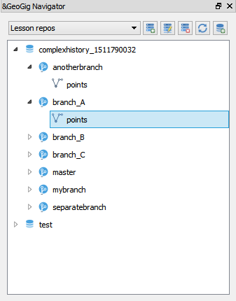

Click on the *Add GeoGig server* button and you will see the following dialog:

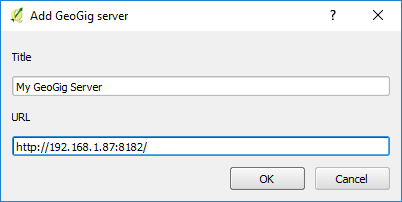

Enter the URL to the WebAPI endpoint (example: http://192.168.1.87:8182/) and a name to identify the service. Click on OK

A new entry in the navigator will be added, which will contain all repositories served by the selected endpoint.

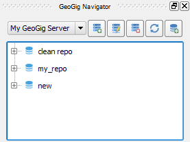

Clicking on a repository will update the elements in the lower part of the navigator. There you can find the repository information and its history.

The history is shown as a tree, with elements representing branches and under each branch all the versions it contains.

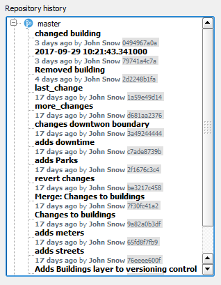

To remove a GeoGig server from the list of available connections, select it in the repositories tree and click on the delete button in the navigator toolbar. 

Creating and deleting repositories
***********************************

New repositories can be added to a GeoGig server. To do it, select the server in the list of available ones in the navigator, and then click on the *Create new repository* icon.

You will be prompted to enter the name of the repository. 

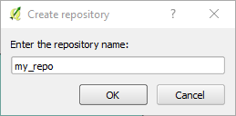

A repository with that name will be created in the GeoGig server and added to the navigator tree.

To delete a repository (**all its data will be removed from the server**), select it and click on the delete button in the navigator toolbar.

Adding layers from a repository to the current QGIS project
*************************************************************

To add a layer from a repository to the current project, select the repository in the navigator and go to the *Repository summary* tab in the lower part of the navigator.

There you will find the list of layers in the repository, and for each one an *Add to QGIS* link. Use these links to add the layers to your project.

If it is the first time you add that layer, it will be downloaded before opening it in QGIS. The most recent version of the layer in the master branch of the repository will be used. 

If the layer had been previously downloaded, but it is not currently loaded into your QGIS project, the downloaded file will be loaded.

You can also add layers from the navigator tree. Expand the item representing the repo and you will see the list of branches. Expanding a branch item will show a list of subitems with the layers available in that branch. A link to add the layer at the version corresponding to the parent branch is shown as well.

If a layer has already been exported (even if it is not in the current QGIS project), but using a version different to the one in the branch, the name of the layer will be rendered in orange. 

.. figure:: img/exportfromtreeorangename.png

If you try to add that layer to your project, you will be asked whether you want to use that previously exported version, or the one from the selected branch.

.. figure:: img/confirmexportname.png

Recovering a given version of a layer
**************************************

If you have a Geogig layer in your project, you can update its content to any existing version of that layer that is contained in the corresponding repository. 

To do so, select the *GeoGig/Change to a different version...* menu entry in the context menu of the layer. It will open the reference selector, and you will be able to select the version you want to update to.

If you have local changes that haven't been added to the repository yet, you will have to sync the layer or discard those changes, before being able to update it to a different version.

Adding a layer to a repository
******************************

To add a layer to a repository, select the repository in the repositories list and then click on the *Add layer to repository* button. You will see the following dialog.

.. figure:: img/addlayer.png

The dropdown list shows all the layers that you have loaded in your current QGIS project and can be added to the repository. 

At the moment only layers in **geopackage** format can be added (http://www.geopackage.org/). You can use QGIS core functionality to export your layer to a gpkg file in case it is in a different format and you want to add it to a GeoGig repository

Select the layer that you want to add to the repository and add a message to describe the change (for instance "*Added roads layer*"). Click on OK.

Layers can be also added from the QGIS interface. Select the layer that you want to import in the QGIS legend and right-click on it. In the context menu, there will be a *GeoGig* section with a menu entry named *Add layer to repository...*.

.. figure:: img/ addlayercontext.png

Select it and the add layer dialog will be shown.

.. figure:: img/ addlayerfromlegend.png

In this case, the selector is not used to select the layer to import, but the repository to import to.

When you add the layer to the repository, a new version is created in the repository with the layer that you have added, and a new entry is also added to the versions list under the destination branch.

Once a layer is imported into a GeoGig repository, it becomes linked to it. The layer context menu will contain new entries that allow operations with the layer as part of a GeoGig repository. 

.. figure:: img/ repolayercontext.png

These entries will be explained in further sections of this document.

If a repository is deleted, layers that were exported from it will not be removed from the current project or deleted locally. However, they will not be linked anymore to a repo, and the above context menu entries will not be available, just like it happens with any other regular QGIS layer.

.. note::
   
   A specific geopackage datasource/layer can be added in only one GeoGig repository. If you need to add the same original geopackage layer in different GeoGig 	repositories then you must create in advance different copies of the same datasource/layer.

Editing a GeoGig layer and creating a new version in the repository
*********************************************************************

To edit a GeoGig layer, just edit it normally, using the QGIS edit functionality. Once you are done editing, you can transfer your changes to the repository by selecting the *Syncronize with repository branch...* in the layer context menu. You will see the following dialog.

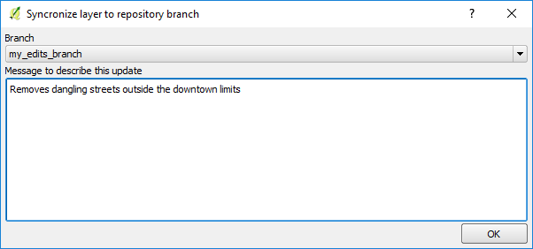

You must enter a message to describe the new version to create (a message describing the changes that are going to be applied to the layer).

The destination branch should also be selected. Only branches that contain the layer to sync will be shown

All new changes in the repository, in the selected branch, that are not yet in the local layer will be downloaded and merged with the local ones.

Click on *OK* and the data will be incorporated to the repository, and a new version will be created.

If you want to confirm that the change has been applied to the repository, you can open the GeoGig navigator, select the repository and display the history of the current branch. You will see that it has a new entry with the same message that you entered in the version description dialog.

.. note::
   
   Modifications to the stucture of attributes table are not supported at the moment.

Conflicts
**********

When you synchronize your local layer (uploading your local changes and fetching new remote ones), it might happen that the features that you have modified have also been modified in the repository by someone else. This causes a conflicting situation that has to be manually solved. For each feature in a conflicted situation (a feature that has been modified differently in your local layer and in the repository), you will have to decide which version of it you want to keep.

When a sync operation results in conflicts, you will see a message like this one:

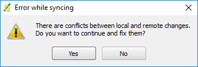

Click on *Yes* to open the conflict solving interface, which looks like this.

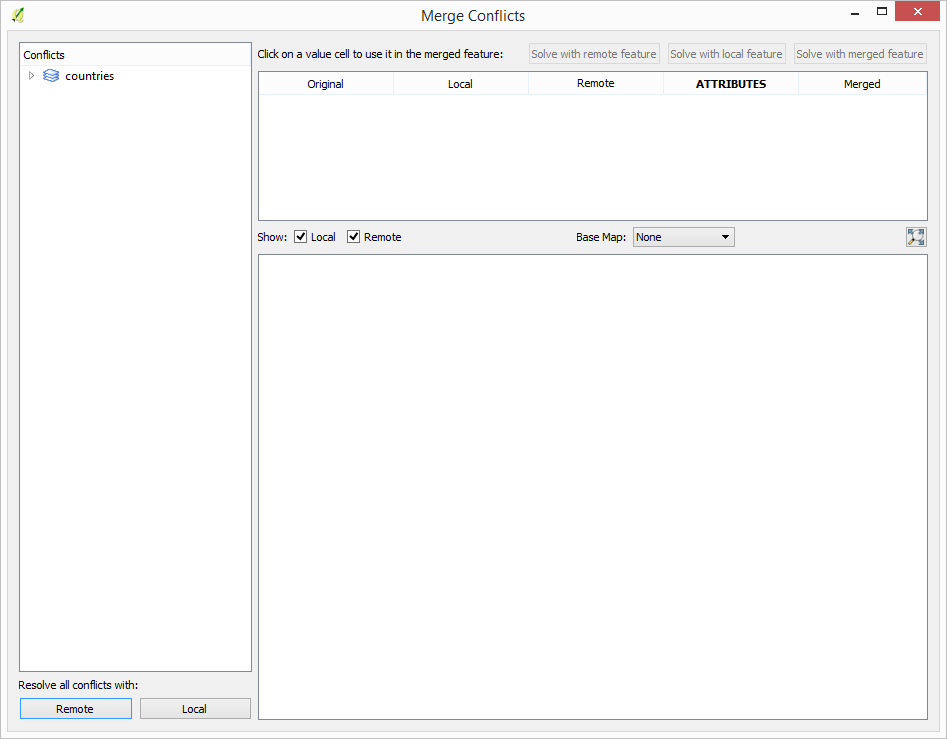

On the left side you will find a list of all conflicted features, grouped by layer. Clicking a feature item will display the conflicting values in the table and canvas on the right side:

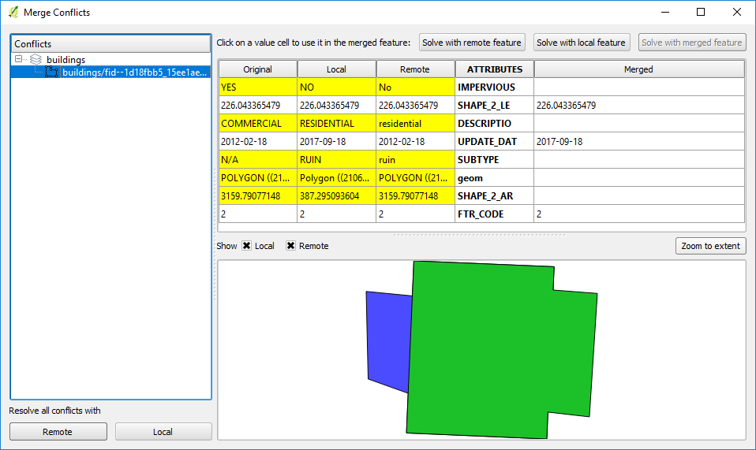

The table shows all attributes and the corresponding values for the two versions in conflict:

* **Remote**: The feature as it was modified in the remote repository.
* **Local**: The feature as it was modified in the local layer.

It also shows the *original* value from which both edits come.

Conflicting values will be shown in *yellow*, and the corresponding *Merged* cell in the table will be empty. If an attribute has no conflict, it will be displayed in *white*, and will also be shown in the *Merged* column.

Solving a conflict is done by selecting the value to use from any of the three columns (*Remote*,  *Local*, *Origin*). Click the version to use, and its value will be put in the *Merged* column. The row will not be shown as conflicted anymore.

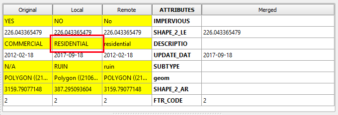

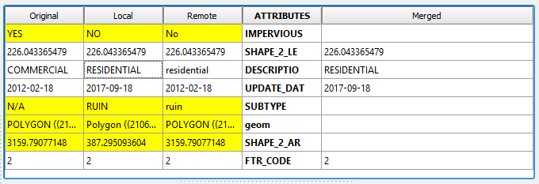

Once the conflict for a given attribute has been solved, you can still click a cell to use its value in the merged feature. You can even do it for  attributes that have no conflicts.

The geometry of the feature, whether conflicted or not, will be represented in the window canvas. You can toggle the rendering of the different versions using the checkboxes.

No interaction is currently available in the canvas other than zooming and panning. To solve a conflict in a geometry, you must use the table.

Once you have solved all conflicts (that is, there are no yellow cells in your attribute table), the *Solve with merged feature* button will be enabled. When you click it, the conflict for the current feature will be solved, and its entry will be inserted in the repository. You can also use the *Solve with local version* and *Solve with remote version* buttons to solve the conflict without having to manually select the value for each conflicted attribute.

Repeat the above steps for each conflicted feature before closing the dialog. After closing the conflicts window, and only if all conflicts were solved, the new version corresponding to the sync operation will be created and added to the history panel. 

Creating a new branch
**********************

To create a new branch, you must select the version in the current history of the repository where the branch starts. In the history panel, expand the branch where that version is located, select the corresponding version and right--click on it. Select the *Create new branch at this version* option and you will be prompted to enter the name of the new branch. Enter the name of the branch and click on *OK*. The new branch will be created and added to the list of branches in the history panel.

Deleting a branch
******************

To delete a branch, right--click on it and select the *Delete this branch* option. The branch will be deleted. 

Visualizing changes using the comparison viewer
****************************************************

To visualize the changes introduced by a given version (that is, the difference between that version and previous one in the history) in the comparison viewer, right-click on it and select the *Show changes introduced by this version* menu. This will open the comparison viewer.

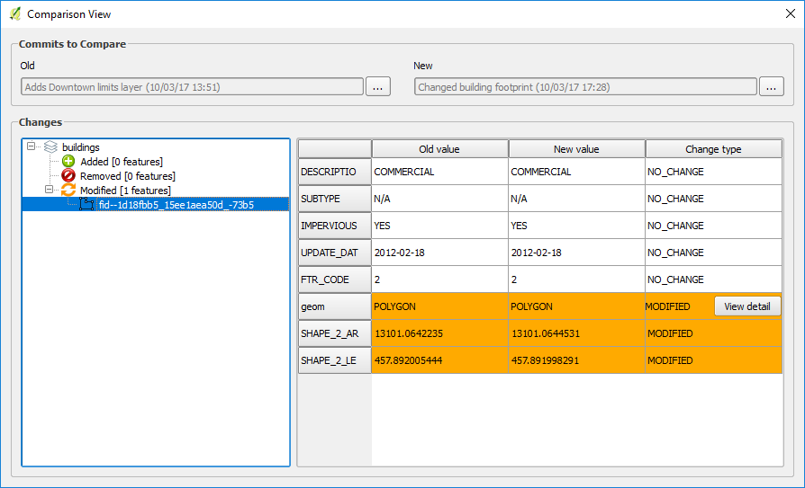

The compared versions are listed in the *Versions to Compare* section at the top of the dialog. When the dialog is opened, it compares the selected version with its parent. You can change any of the versions to be compared by clicking the button next to each text box, which will open the version selector dialog:

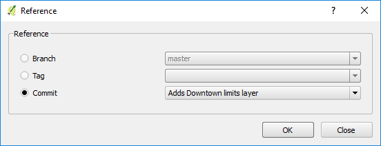

Click *OK* and the selected version will be set in the Comparison Viewer.

Changes are listed in the left-hand side tree, grouped into layers. Expanding the elements in the tree, you can see which features have been edited. Clicking on any of these features, the right-hand side table will be populated with the details of the change.

.. figure:: img/ comparisontable.png

For geometries, a more detailed view is available by right clicking on the geometry attribute and selecting the *Show geometry changes* menu.

.. figure:: img/ geometrychangescontext.png

The geometry comparison viewer will be opened, showing the geometries for both versions of the feature.

.. figure:: img/ geometrychangesdialog.png

Removing a layer from a repository
***********************************

If you no longer want to have a layer in a repository branch, you can select the layer item in the repository tree of the GeoGig navigator, and click on the delete button in the navigator toolbar. A new version will be added to the selected branch, which removes the selected layer from that branch.

The layer will not be unloaded from QGIS and will still be part of you QGIS project. If, after removing the layer from the selected branch, it is not found in any other branch in the repository, the layer won't be tracked anymore. The layer file and the repository will now independent and not linked. Otherwise, the layer will remained tracked, since it can still be synced with other branches of the repo.

Tags
*****

You can add tags to any version in the repository history. To add a tag, select the version that you want to tag in the repository viewer, right-click on it and select *Create new tag at this version...*.You will be prompted to enter the name of the tag to create.

When a version has a tag, it will be shown in the history tree

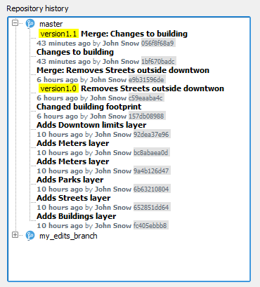

To remove a tag from a version, right-click on the version item and select *Delete tags from this version*.