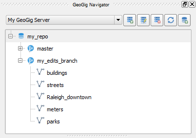

Usage
=====

The GeoGig QGIS plugin allows you to manage/view GeoGig (http://geogig.org/)
repositories and layers as well as editing GeoGig layers using QGIS editing
capabilities.

This document describes GeoGig plugin interface and tools, and a typical
workflow with the GeoGig plugin, going through its main features.

.. warning::

    You need GeoGig 1.1.1 version to use the QGIS plugin; version 1.2 may not
    work due to API changes. You can download it `here <geogig download_>`_.

GeoGig plugin Interface and tools
---------------------------------

GeoGig Navigator panel
......................

The :guilabel:`GeoGig navigator` panel is the plugin's primary tool to interact
with the GeoGig repositories. If :guilabel:`GeoGig navigator` panel is not
visible, you can open it from the menus clicking :menuselection:`Plugins -->
Geogig --> GeoGig Navigator`.

.. figure:: img/navigator.png

   GeoGig Navigator panel

Alternatively, you can enable and disable the panel by clicking the
:guilabel:`GeoGig navigator` button in the :guilabel:`Manage Layers toolbar`.

.. figure:: img/open_navigator.png

   GeoGig Navigator button in the Manage Layers toolbar

In the top of the :guilabel:`GeoGig navigator` panel there is a toolbar **(1)**
with a drop-down list to select a GeoGig server, followed by this buttons:

* |add_server| :guilabel:`Add GeoGig server` sets up a new connection to a
  GeoGig server.
* |edit_server| :guilabel:`Edit GeoGig server` allows changing the name or URL
  of the selected GeoGig server.
* |delete_server| :guilabel:`Delete GeoGig server` deletes the selected GeoGig
  server connection.
* |refresh| :guilabel:`Refresh` updates the full content of the GeoGig server
  tree.
* |add_repository| :guilabel:`Add new repository` creates a new empty repository
  to the current GeoGig server.

Below the toolbar, there is a tree view with the contents of the selected GeoGig
server **(2)**. At the first level, there are the repositories. Each repository
can contain several branches. Inside each branch, you will see the layers under
GeoGig version control. Right-clicking the tree view items will provide access
to related actions in a context menu.

Right-clicking a **Repository** name will provide the following options:

* :guilabel:`Copy repository URL` copy the repository URL to the clipboard.
* :guilabel:`Refresh` updates the content of the repository.
* :guilabel:`Delete` erases the repository, all its branches, layers a
  commit information from the GeoGig server.
* :guilabel:`Manage connections` allows to add, edit and delete remote
  connections to the repository
* :guilabel:`Push` allows publishing your changes into a remote repository.
* :guilabel:`Pull` allows getting changes from a remote repository.

Right-clicking a **Branch** name will provide the following options:

* :guilabel:`Refresh` updates the content of the branch. :guilabel:`Delete`
  removes all the layers and commit information from the GeoGig Server.

Right-clicking a **Layer** name will provide the following options:

* :guilabel:`Add to project` loads the layer in QGIS.
* :guilabel:`Delete` removes the layer from GeoGig tracking.

At the bottom of the panel, there is the :guilabel:`Repository history` **(3)**,
which allows you to see and interact with the commit history of each branch of
the currently selected repository. Inside each branch, you can see all the
commits.

In the :guilabel:`Repository History` right-clicking a **Branch** name open up
the context menu with the following options:

* :guilabel:`Merge this branch into` allows you to try to merge this branch
  changes into another existing branch.
* :guilabel:`Delete this branch` deletes all the layers and commit information
  from the GeoGig Server.

Likewise, right-clicking the **commits** inside a branch will open the context
menu with the following options:

* :guilabel:`Show detailed description of this commit`
* :guilabel:`Show changes introduced by this commit`
* :guilabel:`Export changes introduced by this commit as a layer`
* :guilabel:`Create new branch from this commit`
* :guilabel:`Create new tag at this commit`
* :guilabel:`Delete tags at this commit`

GeoGig Feature Info Tool
........................

The |current_plugin| also provides a *GeoGig Feature Info Tool*. This tool allows
you to inspect features in a loaded layer under GeoGig tracking, and obtain
information about its history.

To enable the GeoGig Feature Info Tool, from menus, select
:menuselection:`Plugins --> GegoGig --> GeoGig Feature Info Tool`.
Alternatively, you can use the button added by the plugin in the
:guilabel:`Manage Layers toolbar`.

.. figure:: img/feature_info_tool_open.png

Once the tool is enabled, in the :guilabel:`Layer panel`, select a layer
to make it active. Then, in the Map canvas
click on any feature of the active layer. Two options will show up in a context
menu:

* :guilabel:`Show all versions of this feature` will open the :guilabel:`Commit
  Viewer` dialog. On the left side of the dialog, there will be a list of commits
  that added or altered information to the selected feature. If you select one of
  those commits, the right side of the dialog will show the attributes and the
  geometry of the feature at that particular commit.

  .. figure:: img/commit_viewer.png

* :guilabel:`Show Authorship` will open the :guilabel:`Authorship` dialog for
  that feature. The top part of the dialog will show the list of attributes of
  the feature, their current value, and the author. Clicking one of the
  attribute rows will populate the bottom part of the dialog, which will provide
  more in detail information about the related attribute.

  .. figure:: img/authorship_dialog.png

GeoGig plugin workflow
----------------------

Starting the GeoGig server
..........................

The GeoGig plugin connects to GeoGig using its WebAPI (for more details on
GeoGig WebAPI see the `GeoGig User Manual <geogig webapi docs_>`_ page).

First, make sure that the GeoGig folder and the Java JVM folder are in your
PATH, so you can call and run GeoGig from any folder in your system.

You can start GeoGig server by running the following command from the folder
that contains you repository folders.

::

    geogig serve -m

You can also run GeoGig server specifying the folder that contains the
repositories that need to be published, for example:

::

    geogig serve -m /path/to/folder_containing_repositories/

If the server starts correctly, you should see a message like this:

::

    Starting server on port 8182, use CTRL+C to exit.

Connecting to a repository server
.................................

The first step to work with the GeoGig plugin is to connect to a GeoGig WebAPI
endpoint, which serves a collection of repositories.

Click the |add_server| *Add GeoGig server* button. the following
dialog opens:

.. figure:: img/addrepos.png

Enter the :guilabel:`URL` to the WebAPI endpoint (example:
http://192.168.1.87:8182/), a :guilabel:`Title` to identify the service, and
click :guilabel:`OK`.

A new entry in the :guilabel:`GeoGig Navigator` will be added, which will
contain all repositories served by the chosen endpoint.

.. figure:: img/reposinnavigator.png

Clicking on a repository or any of its elements will update the
:guilabel:`Repository History` in the lower part of the :guilabel:`GeoGig
Navigator`.

The :guilabel:`Repository History` is shown as a tree, with elements
representing branches, and under each branch all the commits it contains.

.. figure:: img/versionsinbranch.png

Creating and deleting repositories
..................................

New repositories can be added to a GeoGig server. To do it, select the server
from the drop-down list in the :guilabel:`GeoGig Navigator` toolbar and then
click the |add_repository| *Create new repository* icon.

You will be prompted to enter the name of the repository. 

.. figure:: img/createrepo.png

A repository with that name, containing only an empty *master* branch, will be
created in the GeoGig server and added to the GeoGig Navigator tree.

To delete a repository, right-click its name in the navigator tree and choose
:guilabel:`Delete`.

.. figure:: img/delete_repository.png

.. warning::

   Deleting a repository will remove all its data from the GeoGig server.

Import a layer to GeoGig
........................

To put a layer under GeoGig version control, you need to add it to a repository
in your GeoGig server. To do so, In the :guilabel:`Layers panel` right-click the
layer you wish to import to GeoGig and, in the context menu, select
:menuselection:`GeoGig --> Import to GeoGig...`.

.. figure:: img/addlayercontext.png

The :guilabel:`Import to GeoGig` dialog will open. From the
:guilabel:`Repository` drop-down list, choose the repository you wish to import
the layer to. In case the repository has more that one branch, also select the
branch where to add the layer from the :guilabel:`Branch` drop-down list. In the
:guilabel:` Message to describe this updated` add a descriptive message, for
example, *"Adds buildings layer"*. Click :guilabel:`Add layer` to proceed.

.. figure:: img/import_to_geogig.png

.. note::

   At the moment only single layers in **geopackage (\*.gpkg)** format can be
   added (http://www.geopackage.org/). You can use QGIS :guilabel:`Save as...`
   core functionality to export your layer to a *gpkg* file in case it is in a
   different format and you want to add it to a GeoGig repository.

Once the layer is added to the repository, a new commit with the chosen message
is created in the repository selected branch. This can be seen in the
:guilabel:`Repository History` where a new entry with the chosen update message
will be added to the destination branch. Besides, the layer will be listed in
the :guilabel:`GeoGig Navigator` tree.

.. figure:: img/added_new_layer.png

Once a layer is imported into a GeoGig repository, it becomes linked to it. The
layer context menu in the :guilabel:`Layers panel` will contain new entries in
the :guilabel:`GeoGig` menu that allow operations with the layer as part of a
GeoGig repository. These entries will be explained in further sections of this
document.

.. figure:: img/ repolayercontext.png

   GeoGig layer context menu

If a repository is deleted, layers linked to it will not be
removed from the current project or deleted locally. However, they will not be
linked anymore to a repo, and the above context menu entries will not be
available, just like it happens with any other regular QGIS layer.

.. note::

   A specific geopackage datasource/layer can be added in only one GeoGig
   repository. If you need to add the same original geopackage layer in
   different GeoGig repositories, you must create different copies of the same
   datasource/layer in advance.

Loading repository layers to the QGIS project
.............................................

To add a layer from a repository to the current project, in the
:guilabel:`Geogig Navigator` tree, expand a repository item to see the list of
branches. Then, expand a branch items to list all available layers. Right-click
the wanted layer and choose :guilabel:`Add to project`.

If it is the first time you add that layer to a local project, it will be
exported from the GeoGig server and stored locally as a geopackage file before
loading it in QGIS. The most recent version of the layer in the selected branch
of the repository will be used.

If the layer had been previously exported, but it is not currently loaded into
your QGIS project, the locally stored file will be loaded.

If a layer has already been exported (even if it is not in the current QGIS
project), when you try to add that layer to your project, you will be asked
whether you want to use that the previously exported version, or the one from
the selected branch.

.. figure:: img/layer_was_already_exported.png

Creating and deleting branches
..............................

By default, new repositories only have one branch called *master*. The *master
branch* cannot be deleted and it represents the main storyline of the data in
the repository. Nevertheless, other branches can be created to provide a way of
testing changes without affecting the master storyline right away.

To create a new branch, you must select the commit in the current history of the
repository where the branch starts. In the :guilabel:`Repository History`,
expand the branch where the commit is located, select the commit and right-click
on it. Select the :guilabel:`Create new branch at this commit...` option from
the context menu and you will be prompted to enter the name of the new branch.
Enter the name of the branch and click :guilabel:`OK`.

   Create a new branch from context menu

.. figure:: img/choose_branch_title.png

   Choose branch name

The new branch will be created and added to the list of branches in
:guilabel:`GeoGig Navigator`.

   New branch in the GeoGig Navigator tree

From this point forward, you can synchronise your changes to this new branch,
adding new commits to it. Later, if you wish, you can merge all your branch
commits into the *master* branch.

Once a branch is no longer needed, because it has been merged or because the
testing didn't go well, you can remove it from the repository. To delete a
branch, right-click on it in the :guilabel:`GeoGig Navigator` and select the
:guilabel:`Delete` option from the context menu. The branch will be
deleted, as well as all the layers and commit information it contains.

Editing, committing changes to a GeoGig layer
.............................................

To edit a layer under GeoGig versioning, use any of
the available QGIS editing tools as usual. Once you are done editing and have saved them
locally, you can transfer your changes to a GeoGig server repository.

To transfer the layer's local changes to the repository, right-click the edited
layer in the :guilabel:`Layers panel` and
selecting :menuselection:`GeoGig --> Sync layer to branch` from the context
menu. The :guilabel:`Syncronize layer to repository branch` dialog will open.

In the :guilabel:`Branch` drop-down list, select the destination branch. Only
branches containing the layer to sync will be shown.

In the :guilabel:`Message to describe this update`, you should enter a
descriptive message about the changes that are going to be applied to the layer.
This message will help to identify the commit responsible for the changes, in
case you need to go back to it. If you don't provide a commit message, a
timestamp message will be added to the commit automatically.

.. figure:: img/syncdialog.png

Click :guilabel:`OK`. The data will be incorporated to the repository, and a
new commit with the chosen message will be created in the selected branch.

All new changes in the selected repository branch, which were not yet in
the local layer, will be downloaded and merged with the local ones.

If you want to confirm that the change has been applied to the repository, you
can open the :guilabel:`GeoGig Navigator`, select the repository and, in the
:guilabel:`Repository history`, display the history of the chosen branch. You
will see that it has a new entry with the same message that you entered in the
:guilabel:`Syncronize layer to repository branch` dialog.

.. figure:: img/new_edit_commit.png

.. note::
   
   Modifications to the structure of attributes table (delete or rename
   attributes) are not supported at the moment.

Reviewing and discarding local changes
......................................

Before you transfer the layer's local changes to a repository, you may want to
review it. You can do so by right-clicking the edited layer in the
:guilabel:`Layers panel` and selecting :menuselection:`GeoGig --> Show local
changes` from the context menu. A :guilabel:`Comparison View` dialog will open,
where you can see all the changes that have been made in that layer since the
last commit (see :ref:`view_changes_commit` for an in detail description of a
similar dialog).

If you are unhappy with the local changes you made, you can manually edit to fix
some problems before you commit them to the repository or you can just discard
all the layer local changes. To discard all the local changes, right-click the
edited layer in the :guilabel:`Layers panel` and selecting
:menuselection:`GeoGig --> Revert local changes` from the context menu.

Recovering a given version of a layer
.....................................

If you have a Geogig layer in your project, you can update its content to match
any existing commit in the corresponding repository.

To do so, in the :guilabel:`Layer panel`, right-click the layer and choose
:menuselection:`GeoGig --> Change to a different commit...` from the context
menu. It will open the :guilabel:`repository history` dialog, showing all the
branches and commits containing a version of the selected layer. Click the
commit you want to update the layer to. Then, click :guilabel:`OK` to recover
that layer's version.

.. figure:: img/recover_layer_state.png

If you have local changes that haven't been added to the repository yet, you
will have to :guilabel:`Sync layer to branch` or :guilabel:`Discard local
changes` before being able to update it to a different commit. Both actions are
available from the :guilabel:`GeoGig` menu in the layer's context menu.

Reverting a commit
..................

At any point in time, you can also revert all changes created in a particular
commit. To do so, right-click the affected layer in the :guilabel:`Layers panel`
and select :menuselection:`GeoGig --> Revert commit` from the context menu. The
:guilabel:`Select commit` dialog opens showing all the repository commit since
the layer was added. Select the commit to revert, and click :guilabel:`Ok`

.. figure:: img/select_commit.png

The layer will be changed locally to revert all changes introduced by the
selected commit. To transfer this reversion changes, you need to use
:menuselection:`GeoGig --> Sync layer to branch` from the layer context menu in
Layer Panel. A :guilabel:`Syncronize layer to repository branch` dialog shows up
having the message already set. Click :guilabel:`OK` to proceed.

Removing a layer from a repository
..................................

If you want to remove a layer from a repository branch, right-click the layer
item in the repository tree of the :guilabel:`GeoGig Navigator`; then, select
:guilabel:`Delete` from the context menu. A new commit will be added to the
selected branch history, which removes the selected layer from the branch.

.. note::

   The layer will not be unloaded from QGIS and will still be part of your QGIS
   project. If, after removing the layer from the selected branch, it is not
   found in any other branch of the repository, the layer won't be tracked
   anymore. The layer file and the repository will now be independent and not
   linked. Otherwise, the layer will remain tracked, since it can still be
   synced with other branches of the repo.

.. _solve_conflicts:

Solving conflicts
.................

When you synchronize your local layer (uploading your local changes and fetching
new remote ones), it might happen that the features that you have modified have
also been modified in the repository by someone else. This causes a conflicting
situation that has to be manually solved. For each feature in a conflicted
situation, you will have to decide which version of it you want to keep.

When a sync operation results in conflicts, you will see a message like this
one:

.. figure:: img/conflictsmessage.png

If you click :guilabel:`No` the sync process will be canceled. Click
:guilabel:`Yes` to open the :guilabel:`Merge Conflicts` dialog, which will allow
you to solve the conflicts.

On the left side of the dialog, you will find a list of all the conflicting
features, grouped by layer. Clicking a feature item will display the conflicting
values in the table and the canvas on the right side.

.. figure:: img/singleconflict.png

In the table, all the feature's attributes are shown in rows, and the
corresponding values for the two conflicting versions are shown in columns:

* :guilabel:`Remote`: The feature as it was modified in the remote repository.
* :guilabel:`Local`: The feature as it was modified in the local layer.

There are three additional columns in the table:

* :guilabel:`Original`: shows the **original** values from which both edits
  came, that is, the last common version of the feature.
* :guilabel:`ATTRIBUTES`: shows the name of the attributes.
* :guilabel:`Merged`: show the resolution value for each attribute.

Conflicting values will be highlighted in a *yellow* background, and the
corresponding cell in the :guilabel:`Merged` column will be empty. If an
attribute has no conflict, its values will be displayed in a *white* background,
and will also be shown in the :guilabel:`Merged` column.

Solving an attribute conflict is done by selecting the value to use from any of
the three columns (*Remote*,  *Local*, *Origin*). Click the version to use, and
its value will be put in the *Merged* column.

.. figure:: img/conflictunsolved.png

   DESCRIPTIO attribute with an unsolved conflict

The row will not be shown as conflicted anymore.

.. figure:: img/conflictsolved.png

   DESCRIPTIO attribute with solved conflict

Once the conflict for a given attribute has been solved, you can still click a
cell to use its value in the merged feature. You can even do it for attributes
that have no conflicts.

The geometry of the feature, whether conflicted or not, will be represented in
the window canvas. You can toggle the rendering of the different versions using
the :guilabel:`Local` and :guilabel:`Remote` checkboxes.

No interaction is currently available on the canvas other than zooming and
panning. To solve a conflict in a geometry, you must use the table above to
select the geometry version to use.

Once you have solved all conflicts (that is, all the cells in the
:guilabel:`Merged` column are filled and there are no yellow cells in the
attribute table), the :guilabel:`Solve with merged feature` button will be
enabled. When you click it, the conflict for the current feature will be solved,
and its entry will be inserted in the repository.

.. figure:: img/all_conflicts_solved.png

If for the selected feature conflict you want to use all the values from
either the :guilabel:`Remote` or the :guilabel:`Local` columns, you can use the
:guilabel:`Solve with local version` or :guilabel:`Solve with remote version`
buttons, respectively, to solve the conflict without having to select
the value manually for each conflicted attribute.

On the other hand, if for all conflicting features, in all layers, you wish to
keep either all the remote or all the local changes, next to :guilabel:`Resolve
all conflicts with`, click :guilabel:`Remote` or :guilabel:`Local`, respectively.

Use any of the above steps to resolve all conflicted features before closing the
:guilabel:`Merge conflicts` dialog.
After closing the conflicts window, and only if all conflicts were solved, the
new commit corresponding to the sync operation will be created and added to the
history panel.

Getting more information about a commit
.......................................

At any time, to get more information about a given commit, you can right-click
on it in the :guilabel:`Repository History` and select :guilabel:`Show detailed
description of this commit` from the context menu. The :guilabel:`Commit
description` dialog will open.

.. figure:: img/commit_full_description.png

.. _view_changes_commit:

Visualizing changes introduced by a commit
..........................................

To visualize the changes introduced by a given commit (that is, the difference
between that commit and the previous one in the history)  you can use the
:guilabel:`Comparison view`. To do so, in the :guilabel:`Repository history`
right-click the commit and select the :guilabel:`Show changes introduced by this
commit` from the context menu. This will open the comparison viewer.

.. figure:: img/comparisonviewer.png

The compared versions are listed in the :guilabel:`commits to Compare` section
at the top of the dialog. When the dialog is opened, it compares the selected
commit (new) with its parent (old).

Changes are listed in the left-hand side tree, grouped into layers. Expanding
the elements in the tree, you can see which features have been edited. Clicking
on any of these features, the right-hand side table will be populated with the
details of the change.

For geometries, a more detailed view is available by clicking the
:guilabel:`View details` in the :guilabel:`Change type` column.

The :guilabel:`Geometry comparison` dialog will be opened in :guilabel:`Map
view`, showing the geometries for both the versions of the feature. The green
dots represent the newly added nodes, while the red ones represent the deleted
nodes.

.. figure:: img/geometrychangesdialog.png

You can also switch to the :guilabel:`Table view` tab, where you can compare the
geometry changes by looking into the geometry nodes' coordinates.

Visualizing changes between two commits
.......................................

You can also use the :guilabel:`Comparison view` to compare commits that are not
parent and child. To do so, in the :guilabel:`Repository history`, click on two
commits while holding the :kbd:`CTRL` key. Then, right-click one of them and,
from the context menus choose :guilabel:`Show changes between selected commits`.
This will open the :guilabel:`Comparison viewer` dialog.

The compared versions are listed in the :guilabel:`commits to Compare` section
at the top of the dialog. When the dialog is opened, it compares the selected
commits as :guilabel:`new` and :guilabel:`old`.

The rest of the dialog works as described in the :ref:`previous section <view_changes_commit>`.

Please notice that changes introduced by the commit set in :guilabel:`Old` will
not be visible in the :guilabel:`Comparison viewer`, as it is considered to be
the starting point. If needed, select its parent commit instead.

You can change any of the commits to be compared by clicking the
:guilabel:`...` button next to each text box, which will open the
:guilabel:`Reference` dialog.

.. figure:: img/referenceselector.png

In the :guilabel:`Reference` dialog, you can select either a :guilabel:`Branch`
head (the most recent commit in a branch), a :guilabel:`tag` (a name given to a
particular commit) or a :guilabel:`commit` directly. Click :guilabel:`OK`. The
selected commit will be set in the :guilabel:`Comparison Viewer`.

Exporting changes introduced by a commit
........................................

It is also possible to export the changes introduced by a commit and visualize
them in the map canvas. In the :guilabel:`Repository history` right-click the
commit and select the :guilabel:`Export changes introduced by this commit as a
layer` from the context menu.

A layer called *diff* will be loaded in the :guilabel:`Layers panel` and visible
in the map canvas. That layer will contain all features that were added,
modified or deleted with the selected commit. Modified features will show up
twice, one for before the commit, and another for after the commit.

In the map canvas, newly added features will be shown in green, deleted features
in red, and modified ones in yellow.

Adding and removing Tags to a commit
....................................

Tags are easy to remember names that you can give to commits. You can add tags
to any commit in the repository history. To add a tag to a commit, right-click
on it in the :guilabel:`Repository history` and select :guilabel:`Create new
tag at this commit...`. You will be prompted to enter the name of the tag to
create, for example, *version1.1*.

When a commit has a tag, it will be shown in the :guilabel:`Repository history`
tree.

.. figure:: img/tagintree.png

To remove all tags from a commit, right-click on it in the :guilabel:`Repository
History` and select :guilabel:`Delete tags from this version`.

Collaborating with others
-------------------------

As with other "non-spatial" versioning tools, one of the main goals of GeoGig is
to allow collaboration, in this case, collaboration while editing spatial data.
Using GeoGig workflow, several people can be editing the same data sets, and
GeoGig allows to ensure that no one work is lost. There are several ways you can
setup GeoGig inside your organization to enable that collaboration.

The organization can set up **one GeoGig server as a shared service, and all the
collaborators use the same URL**. They can all work on the master branch, but that may
be confusing. So a better approach may be each collaborator create a branch to
work on and commit changes, and then a project manager would take care of
merging changes into the master branch. The workflow for this setup was already
fully described in the above sections.

Another, a bit more elaborate, way of setting up a GeoGig project for
collaboration within your organization is to have that same **GeoGig server as a
shared service which can work as the centralized repository and a local GeoGig
server per each collaborator**.

In this case, the sharing workflow needs a bit more of explanation.

Managing remote connections
...........................

Having a repository in your personal GeoGig server, you can add remote
connections for other similar repositories, from where you can retrieve
data and commits (pull) and send your own data and commits back (push).

Create a new empty Repository in your personal GeoGig Server using the
:guilabel:`Add new repository` button in the toolbar. Then, in the
:guilabel:`GeoGig Navigator`, right-click the new repository name and select
:guilabel:`Manage Remote Connections`. The :guilabel:`Remote connections
manager` dialog will open.

Click :guilabel:`Add connection`. Then, in the :guilabel:`New connection`,
provide a :guilabel:`Name` and :guilabel:`URL` for a remote repository.

.. figure:: img/add_new_remote_connection.png

.. note::

   Others can provide you a link to their repositories by right-clicking the
   repositories names in the :guilabel:`GeoGig Navigator` and selecting
   :guilabel:`Copy repository URL`

In the :guilabel:`Manage Remote Connections`, you can also edit and delete
existing connections.

Click :guilabel:`Close` once you are done adding remote connections

Getting data from a remote connection
.....................................

To get data and commit information from one of your remote connections into your
own repository (for example, to get all the data and commits from the shared
GeoGig Server), in the :guilabel:`GeoGig Navigator`, right-click your repository
name and select :guilabel:`Pull`. The :guilabel:`Remote reference` dialog opens.
Select the :guilabel:`Remote` and the :guilabel:`Branch` from where you wish to
import data and click :guilabel:`OK`.

All remote commits that were not present in your repository will get merged into
your own local repository. In case of conflicts, the :guilabel:`Merge conflicts`
dialog will appear (see the :ref:`solve_conflicts` section).

Push changes to a remote connection
...................................

After you edited the data and synchronized it into your repository, you can send
the changes to other remote repositories. In the :guilabel:`GeoGig Navigator`,
right-click your repository name and select :guilabel:`Push`. The
:guilabel:`Remote reference` dialog opens. Select the :guilabel:`Remote` and the
:guilabel:`Branch` from where you wish to export data and click :guilabel:`OK`.

All local commits that were not present in the remote repository will be merged
into the remote repository.

.. SUBSTITUITIONS

.. |add_server| image:: img/add_server_button.png
   :width: 1.5em
.. |edit_server| image:: img/edit_server_button.png
   :width: 1.5em
.. |delete_server| image:: img/delete_server_button.png
   :width: 1.5em
.. |refresh| image:: img/refresh_server_button.png
   :width: 1.5em
.. |add_repository| image:: img/add_repository_button.png
   :width: 1.5em

.. EXTERNAL LINKS

.. _geogig download: https://github.com/locationtech/geogig/releases/tag/v1.1.1
.. _geogig webapi docs: http://geogig.org/docs/interaction/geoserver_web-api.html