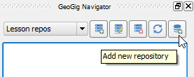

As you can see, the **GeoGig Navigator** panel is now open.

---
**Note**

Since both the **GeoGig Navigator** and **Lessons** panel open by default docked
on the right side of QGIS window, to make more space for reading the lesson
steps' description, we strongly suggest you move one of them elsewhere.

---

The lesson plugin has setup a new GeoGig server, called *Lesson Repos*, that
uses the `http://localhost:8182` endpoint.

To be able to add a layer to the GeoGig versioning system, you need to create a
Repository to hold the spatial data and the commit history. That's what we will
do next.

* In the **GeoGig Navigator** toolbar, click the **Create new repository**.

    

* In the **Create repository** dialog, type in a suggestive name for the
  repository, for example, `my_repo`. Click **OK**

    

In the **GeoGig Navigator** tree, you will now see the repository name. If you
expand it, you will find a *master* branch in it, which is created by default
for all new repositories.

Click **Next step** once you are done.