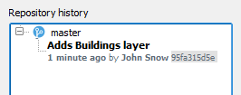

This lesson project has a layer called buildings. To have it under
GeoGig versioning control, you need to import it to the newly created
repository.

In the **Layers Panel**, right-click the *Buildings* layer. From the
context menu, select **GeoGig > Import into GeoGig**.

In the **Import to GeoGig** dialog, set the following:

* **Repository**: `Lesson repos - my_repo`
* **Branch**: `master`
* **Message to describe this update**: `Adds Buildings layer`

* Click **Add layer**

In the **GeoGig Navigator** tree, expand the *my_repo* and the
*master* branch. You will see that the *Buildings* layer is now in the
repository.

Below, in the **Repository History**, under the *master* branch, you
also will see the commit that added the layer to GeoGig.

Click **Next step** once you are done.