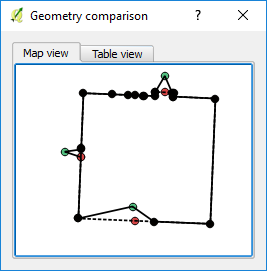

Before you transfer your changes to the GeoGig server, you may want to
confirm what has been changed. GeoGig Plugin has a convenient tool for
it.

* In the **Layers panel**, right-click the *Buildings* layer. From the
  context menu, select **GeoGig > View local changes**. The **Comparison
  View** dialog opens.

* On the left side tree view, expand the **Buildings** Layer and the
  **Modified \[1 item\]**.

    

* Under the **Modified** item, there's a list of the changed features.
  In our case there is only one feature listed, click on it. On the
  right side of the dialog, a table will show a table with attributes
  changes.

    

You can also view the geometry changes.

* In the *geom* row, click the **View details** button on the *Change
  type* column. A **Geometry comparison** dialog shows up, showing the
  old and the new geometries. Re

    

* Click the **Table view** to see the changes as a list of changed nodes
  and its coordinates.

* Close the **Geometry comparison** dialog and then the **Comparison
  View** dialog.

Once you are done, click **Next step**

