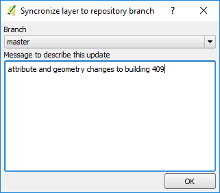
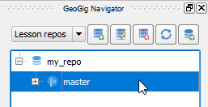
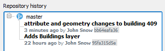

Assuming that you are happy with the changes, you can now transfer them
to the GeoGig repository.

* In the **Layers panel**, right-click the *Buildings* layer. From the
  context menu, select **GeoGig > Sync layer with branch...**. The
  **Syncronize layer to repository branch** dialog opens.

* In the **Syncronize layer to repository branch**, keep the **Branch**
  as `Master` and add a **Message to describe the update**. For example,
  `"attribute and geometry changes on building 409"`. Click **OK**

  

You can confirm that the changes were saved in the GeoGig repository.

* In the **GeoGig Navigator**, click the *master* branch in the
  *my_repo* repository.

    

* Then, in the **Repository history** below, expand the *master* branch,
  and you will see a new commit with the description message you set
  before.

    

This step ends the lesson, click **Finish**.