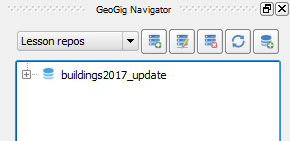
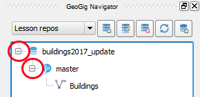
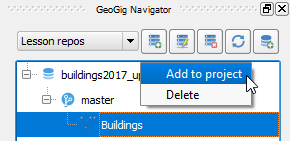

For this lesson, you will notice that there is already a repository
in the GeoGig server.

For this lesson, let's imagine that this is a GeoGig
server you share with other coworkers and that the
repository holds versioned information about
buildings that you and your colleagues were tasked to update.

You will notice that the current QGIS project has no *Buildings* layer
yet. That's because we will need to load it from the repository. This is
what we will do in this step.

* In the **GeoGig Navigator**, expand the
  repository and its *master* branch contents. You will see a *Buildings*
  layer under the branch.

    

* Right-click the *Buildings* layer and select **Add to project**

    

The *Buildings* layer should load into the current project.

Click **Next step** once you are done.