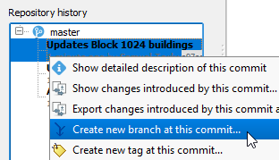
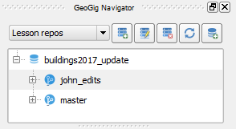
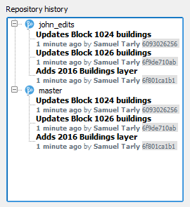

Since we are working with others, it may be a good practice not to commit
changes directly to the *master* branch, at least not until all changes
are final. For that reason, we will create a new branch for your
edits, where you will be able to work and sync your changes without
affecting the master branch.

* In the **GeoGig Navigator**, if you haven't done it already, click any
  of the repo items to populate the **Repository History**.

* In the **Repository history**, expand the *master* branch contents to
  see all the branch previous commits.

* Right-click the top most commit from the list (which is the most
  recent) and select **Create new branch at this commit**

  

* In the **Create New Branch** dialog, enter the name for the new
  branch as `john_edits`, and click **OK**.

Now, in the **GeoGig Navigator**, if you expand the
repository, you should be able to see the newly created branch.

Besides, in the **Repository history** you can confirm that, for now, both the
branches have the same commits.

Click **Next step** once you are done.