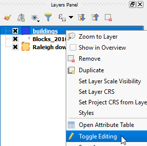
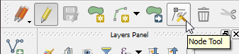
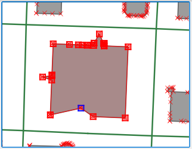
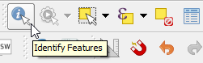
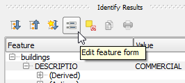
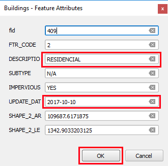
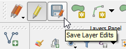

Now, that you have our personal branch, you can update the layer and
synchronize the changes to it.

The layer editing is done, as usual, using QGIS digitizing tools and
attributes editing. We will start by editing a geometry.

* In the **Layers Panel**, right-click the *Buildings* layer and select
  Toggle Editing* to make the layer editable.

    

* In the **Digitizing toolbar**, click the node tool button to enable it.

    

* Use the node tool to change the geometry of the building in the *Block
  1025*, which should be in the center of the map canvas. For example,
  remove some vertices.

    

* From the **Attributes toolbar**, click the **Identify Features** button
  to enable it.

    

* Then, click on the edited feature.

* If the Feature Attributes form does not appear automatically, in the
  **Identify Results** panel, click the **Edit Feature Form** button.

    

* In the **Buildings - Feature Attributes** dialog, change any of the
  feature's attributes. For example, change the **DESCRIPTIO** field
  from `COMMERCIAL` to `RESIDENTIAL`, and set the **UPDATE_DAT** field
  to today's date. Click **OK**.

    

* In the **Digitizing toolbar**, click the **Save Edits** button, to
  save the changes you made.

    

Once you are done, click **Next step**.

