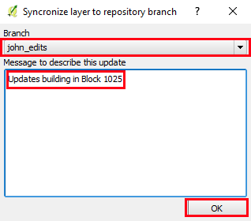

Assuming that you are happy with the changes, you can now transfer them
to the GeoGig repository.

* In the **Layers panel**, right-click the *Buildings* layer. From the
  context menu, select **GeoGig > Sync layer with branch...**. The
  **Syncronize layer to repository branch** dialog opens.

* In the **Syncronize layer to repository branch**, set the **Branch**
  to `John_edits` and add a **Message to describe the update**. For example,
  `"attribute and geometry changes on building 409"`. Click **OK**

  

You can confirm that the changes were saved in the GeoGig repository.

* In the **GeoGig Navigator**, click the *buildings2017_update*
  repository.

    

* Then, in the **Repository history** below, expand both *master*
  and *john_edits* branches. You will see that the branches history
  will differ on one commit, the one you have just done.

    

Once you are done, click **Next step**.