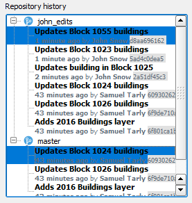

In a real situation, you would keep repeating the last two
steps until you have updated all the buildings you have been tasked to
update. Note that, each commit could (or even should) include updates to
several different features. For the sake of brevity, as an example, we
added a few more commits to the *john_edits* repository and we will
assume that all "your" buildings have been updated.

Before you merge the changes into the *master* branch, you may want to
confirm what has been changed since you start working on the new branch.
GeoGig Plugin has a convenient tool for it.

* In the **Repository History**, expand both the *john_edits* and the
  *master* branches.

* Holding the **CTRL** key, click the topmost commit (the most recent one)
  in each branch.

    

* Having the two commits selected, right-click one of them and select
  show changes between selected commits from the context menu. The
  **Comparison View** dialog opens.

* On the left side tree view, expand the **Buildings** Layer and the
  **Modified**.

    

* Under the **Modified** item, there's a list of the changed features.
  If you click the features, on the right side of the dialog, a table
  will show a table with attributes changes.

    

You can also view the geometry changes.

* In the *geom* row, click the **View details** button on the *Change
  type* column. A **Geometry comparison** dialog shows up, showing the
  old and the new geometries.

    

* Still in the **Geometry comparison** dialog, click the **Table view**
  to see the changes as a list of nodes and their coordinates before and
  after the edits.

* Inspect all the features you wish. Then, close both the **Geometry
  comparison** and the **Comparison View** dialogs.

Once you are done, click **Next step**