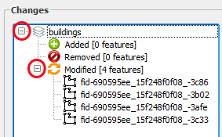
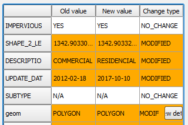

In a real workflow situation, you would keep repeating the last two
steps until you have updated all the buildings you have been tasked to
update. Obviously, each commit could (or even should) include updates to
several different features. For the sake of brevity, in this lesson, we
will assume that you already did all the necessary updates. So you are
ready to merge your work into the *master* branch.

Before you merge the changes, you may want to confirm what has been
changed since you start working on the new branch. GeoGig Plugin has a
convenient tool for it.

* In the **Repository History**, expand the *john_edits* branch.

* Holding the **CTRL** key, click the commit that you used to create the
  branch, and then the most recent commit in the branch.

* Having the two commits selected, right-click one of them and select
  show changes between selected commits from the context menu. The
  **Comparison View** dialog opens.

* On the left side tree view, expand the **Buildings** Layer and the
  **Modified \[1 item\]**.

    

* Under the **Modified** item, there's a list of the changed features.
  If you click the features, in the right side of the dialog, a table
  will show a table with attributes changes.

    

You can also view the geometry changes.

* In the *geom* row, click the **View details** button on the *Change
  type* column. A **Geometry comparison** dialog shows up, showing the
  old and the new geometries. Re

    

* Click the **Table view** to see the changes as a list of changed nodes
  and its coordinates.

* Inspect all the features you wish. Then, close the **Geometry
  comparison** dialog and then the **Comparison View** dialog.

Once you are done, click **Next step**