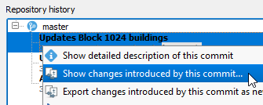
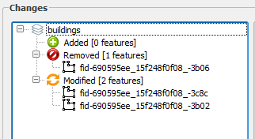
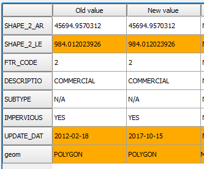
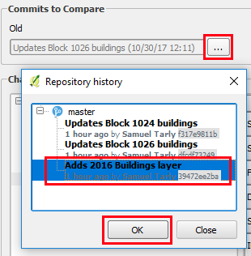

You can see the differences between two commits by using the **Repository history** tree in the **GeoGig Navigator** panel.

* In the **GeoGig Navigator** select *simple_####* repossitory to populate the repository history.

* In the **Repository history** tree below, expand the master branch to visualise all the commits.

* Right-click the latest (top-most) commit in the *master* branch, and select **Show changes introduced by this commit** to open the **Comparison viewer**.

    

* In the **Comparison viewer**, in **Changes**, you will see a list of
  all features that have been added, deleted or modified.

    

* Click a feature to see its changes details in the changes table

    

---

Notice that you can show the differences between any two arbitrary
commits by changing the commit references upper in **Commits to
Compare** section of the dialog.

---

Click **Next step** once you are done.

