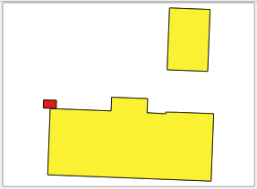

Differences introduced by a commit can also be exported as a layer.

* In the **Repository history**, right-click the latest (top-most)
  commit in the *master* branch and select **Export changes introduced
  by this commit as a new layer**.

    

  A new layer called *Buildings(diff)* will be added to the current QGIS
  project. It's legend indicates the type of change that each feature
  has had.

  

  

Click **Next step** once you are done.

