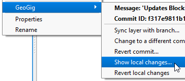

You can also visualize the changes in a layer before they are commited
to the repo.

Some changes have been added to the local copy of the *Buildings* layer,
but they were not synchronized to the repository yet.

* In the **Layer Panel**, right-click the *Buildings* layer and select
  **GeoGig > Show local changes**.

    

  The Comparison viewer will open, which works exactly like the one we
  have seen in the last step.

  This step ends the lesson, click **Finish**.

