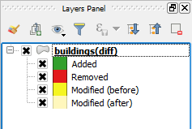

Differences introduced by a commit can also be eported as a layer

* Right-Click on the latest commit in the *master* branch and select "Export changes as layer"

* A new layer will be added to the current QGIS project. It's legend indicates the type of change that each feature has had.

Click **Next step** once you are done.

